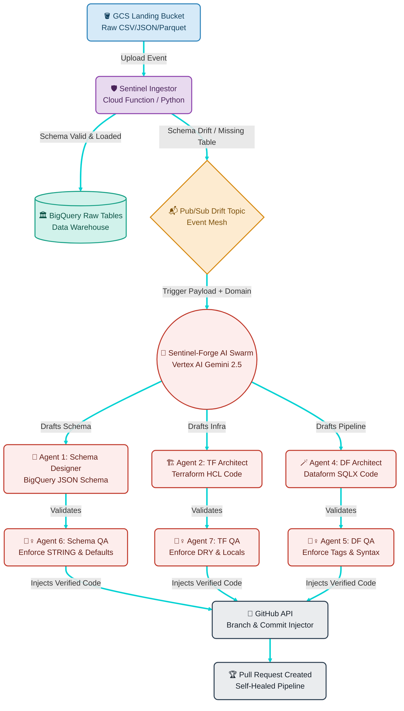

# 🛡️ Sentinel-Forge: Autonomous Agentic Data Engineering

> **Stop building pipelines. They are the technical debt of 2024.**
>
> In 2026, if you are still manually mapping `source_field_a` to `target_field_b`, you aren't an engineer; you're a human compiler. The era of Agentic Data Engineering is here. We don't write ETL anymore—we define Intent.

**Sentinel-Forge** is a fully autonomous, self-healing data ingestion and infrastructure platform. When upstream source files change (Schema Drift) or new datasets arrive, Sentinel doesn't just alert you. A swarm of specialized AI agents analyzes the payload, writes the Terraform infrastructure, generates the Dataform (`.sqlx`) pipelines with dynamic casting, and opens a Pull Request for your review.

The role of the Senior Data Engineer has officially moved from "Plumber" to "Agent Controller."

---

## 🏗️ High-Level Architecture

The system is split into two primary microservices:

1. **`sentinel-ingestor`**: The intelligent vanguard. A Cloud Function triggered by GCS uploads. It dynamically validates incoming files against the BigQuery warehouse. If the schema matches, it loads the data. If it detects **Schema Drift** or a **Missing Table**, it halts, packages a payload containing sample data and domain telemetry, and fires it to a Pub/Sub event mesh.
2. **`sentinel-forge`**: The AI Agent swarm. Triggered by the Pub/Sub drift event, this multi-agent engine utilizes Vertex AI (Gemini 2.5 Flash & Flash-Lite) to reverse-engineer the required infrastructure and pipeline code, submitting a flawless PR to your GitHub repository.

## 🧠 The Agent Swarm (`sentinel-forge`)

Sentinel-Forge employs a highly optimized **Maker/Checker Multi-Agent Architecture** to autonomously engineer and heal your data platform. To drastically reduce costs and maintain high efficiency, tasks are dynamically routed to **Tiered Models**: Heavy reasoning goes to `gemini-2.5-flash`, while routing and QA go to `gemini-2.5-flash-lite`.

### 🤖 The Agents

- **🕵️‍♂️ The Scanners & Routers [Lite]:** The Scanner reads the existing Dataform repository via the GitHub API to infer active domains, target datasets, and existing SQLX code styles. The Dataset Analyst uses semantic matching to securely map incoming tables to the correct raw, staging, and mart layers without hallucinating new dataset names.
- **🧩 The Schema Designer [Lite]:** Formulates strict BigQuery JSON schemas based on the data payload. It enforces absolute `STRING` types for all incoming raw columns to prevent ingestion crashes and embeds mandatory `defaultValueExpression` attributes for enterprise compliance.
- **🏗️ The Terraform Architect [Heavy]:** Synthesizes HCL to deploy infrastructure.
  - **Adaptive Feature:** It intelligently parses existing repository structures and injects resources into existing `locals` map dictionaries (e.g., `tables_raw = {}`) to prevent duplicate block hallucination.
  - It also automatically provisions `_hist` archive tables, enforcing the DRY (Don't Repeat Yourself) principle by reusing the main table's JSON schema file.
- **🪄 The Dataform Architect [Heavy]:** The core Analytics Engineer.
  - Generates perfectly formatted `.sqlx` files utilizing explicit domain folder routing (`layer/domain/entity/file.sqlx`).
  - Analyzes sample data to dynamically inject the correct `SAFE_CAST` and `SAFE.PARSE_DATE` logic for every column.
  - Implements `incremental` models with BigQuery cluster/partition configurations and strict `CURRENT_DATE() AS batch_date` temporal lineage across all layers.
- **🕵️‍♀️ The QA Gatekeepers [Lite]:** The ruthless reviewers of the swarm. They cross-examine the JSON, Terraform, and Dataform code generated by the Architects.
  - They forcefully strip out hallucinated variables and fake dependencies.
  - Correct SQL syntax and align formatting.
  - Validate explicit casting logic.
  - Enforce a strict 3-part tag taxonomy (`[domain, entity, layer]`) on all Dataform configs.

---

## ✨ Enterprise Features

### 🛡️ Anti-Hallucination & Governance

- **Locked File Paths:** The Forge enforces strict path constraints, physically preventing the AI from hallucinating duplicate files or changing the folder architecture.
- **Adaptive Terraform Injection:** Recognizes advanced Terraform patterns (like `for_each` over `locals` maps) and injects configurations into the maps rather than appending clumsy duplicate `resource` blocks.
- **Strict Template Adherence:** Dataform `type: "declaration"` files are stripped of illegal `tags` properties, while staging and marts are strictly bound to enterprise standards (Assertions, Qualify Deduplication, etc.).

### 🚦 Google Cloud Quota Protection (Traffic Smoothing)

Multi-agent systems fire a massive burst of LLM requests in seconds, easily hitting HTTP 429 (Resource Exhausted) errors. Sentinel-Forge includes:

- **Traffic Smoothing:** Base 3-second pacing between LLM executions.
- **Exponential Backoff with Jitter:** A custom resilience wrapper that detects 429 quota hits, applying randomized exponential backoff (5s, 10s, 20s...) and retrying up to 5 times to ensure the pipeline always heals successfully without crashing.

### 🧬 Dynamic Telemetry & Domain Threading

The `sentinel-ingestor` reads routing rules from a dynamic metadata table (`ingestion_master`). It extracts the business `domain` and threads this metadata directly through the Pub/Sub event mesh. The Forge agents use this `domain` to natively organize Dataform folders and tag taxonomies without human intervention.

---

## 🚀 Setup & Deployment

### 1. BigQuery Metadata Tables

You must provision the telemetry and routing tables in your `sentinel_audit` dataset:

- `ingestion_master`: Defines `file_pattern`, `target_dataset`, `target_table`, `domain`, `skip_header_rows`, etc.
- `ingestion_log`: Stores the historical audit ledger of all ingestion attempts (successes, fail-overs, schema drift events).
- `ai_ops_log`: Stores the deferred audit logs generated by the Sentinel-Forge agents containing the Pull Request URLs.

### 2. Environment Variables (`sentinel-ingestor`)

| Variable             | Description                           | Example                                   |
| :------------------- | :------------------------------------ | :---------------------------------------- |
| `GCP_PROJECT`        | Your Google Cloud Project ID          | `my-data-project`                         |
| `METADATA_DATASET`   | Dataset housing routing/audit logs    | `sentinel_audit`                          |
| `MASTER_TABLE`       | Routing rules table                   | `ingestion_master`                        |
| `LOGS_TABLE`         | Ingestion audit log table             | `ingestion_log`                           |
| `ARCHIVE_BUCKET`     | Fallback bucket for quarantined files | `my-archive-bucket`                       |
| `PUBSUB_TOPIC_DRIFT` | Pub/Sub topic to trigger the AI Swarm | `projects/my-project/topics/schema-drift` |

### 3. Environment Variables (`sentinel-forge`)

| Variable           | Description                           | Example                       |
| :----------------- | :------------------------------------ | :---------------------------- |
| `GCP_PROJECT`      | Your Google Cloud Project ID          | `my-data-project`             |
| `GCP_REGION`       | Vertex AI Execution Region            | `us-central1`                 |
| `REPO_NAME`        | Target GitHub Repository              | `org/data-platform`           |
| `GITHUB_TOKEN`     | PAT with repo write access            | `ghp_xxxxxxxx`                |
| `SCHEMA_BASE_PATH` | Path in repo for BQ JSON schemas      | `infra/bigquery/tables/json/` |
| `TF_BASE_PATH`     | Path in repo for TF configs           | `infra/bigquery/tables/`      |
| `AI_MODEL_HEAVY`   | Vertex AI model for complex synthesis | `gemini-2.5-flash`            |
| `AI_MODEL_LITE`    | Vertex AI model for routing and QA    | `gemini-2.5-flash-lite`       |

---

## 🤝 How to trigger the magic

1. Upload a CSV/JSON/Parquet file to your GCS Landing bucket with a completely new column or structural change.
2. Watch `sentinel-ingestor` detect the drift, safely quarantine the file, and ping Pub/Sub.
3. Open GitHub and watch as `sentinel-forge` creates a new branch, writes the Terraform, patches the JSON schema, authors dynamic Dataform `.sqlx` code, and opens a ready-to-merge Pull Request.

**Welcome to 2026.**
_Built with ❤️ for the Sentinel Data Platform._
