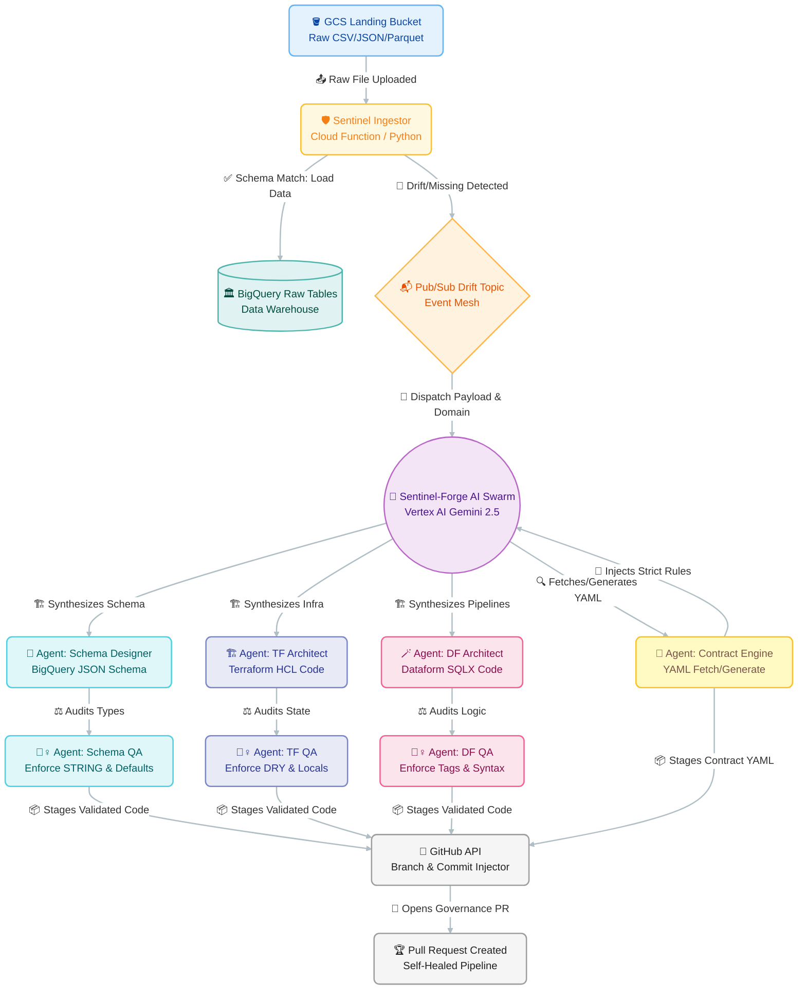

# 🛡️ Sentinel: Autonomous Agentic Data Engineering

[](https://python.org)
[](https://cloud.google.com/dataform)
[](https://terraform.io)
[](https://cloud.google.com/vertex-ai)
[](https://cloud.google.com/bigquery)
[](LICENSE)

> *"Stop writing pipelines. Start defining intent."*
>
> In 2026, if you are still manually mapping `source_field_a` to `target_field_b`,
> you aren't an engineer — you're a human compiler.
> The era of Agentic Data Engineering is here.

---

## What Is Sentinel?

**Sentinel** is a fully autonomous, self-healing data engineering platform built on Google Cloud. When upstream schemas drift or new datasets arrive, a swarm of specialized AI agents analyzes the payload, synthesizes Terraform HCL infrastructure, generates Dataform `.sqlx` pipelines with dynamic type casting, and opens a validated GitHub Pull Request — with zero manual intervention.

The role of the Senior Data Engineer has officially moved from **Plumber** to **Agent Controller**.

---

## The Problem It Solves

| Pain Point | What Happens Today | What Sentinel Does |
|---|---|---|
| Schema drift | Manual BigQuery + Terraform + Dataform triage. Hours of MTTR. | Detects, quarantines, synthesizes all three, opens a PR. Minutes. |
| New table onboarding | Weeks of boilerplate staging/mart models per source. | Reverse-engineers contracts, generates full pipeline stack autonomously. |
| Human bottleneck | Engineers in the critical path for every infrastructure change. | Agents handle synthesis + QA. Humans review at the merge gate only. |

---

## Repository Structure

```
sentinel/
├── .github/
│   └── workflows/                  # GitHub Actions — all deployments via pipeline
│
├── definitions/                    # Dataform SQLX definitions
│   ├── sources/                    # type: "declaration" — raw layer source tables
│   ├── staging/                    # stg_* models — cleansing, casting, deduplication
│   └── marts/                      # fct_* / dim_* models — business metric layer
│
├── infra/
│   └── bigquery/
│       └── tables/
│           ├── *.tf                # Per-domain Terraform resource files
│           └── json/               # BigQuery JSON schema files
│               ├── ingestion_master.json
│               ├── ingestion_log.json
│               └── ai_ops_log.json
│
├── workflow_settings.yaml          # Dataform project configuration
├── package.json                    # @dataform/core 3.0.47
├── ARCHITECTURE.md
├── CONTRIBUTING.md
└── README.md
```

**Language breakdown:** Python 68.2% · HCL 15.8% · HTML 15.9% · Dockerfile 0.1%

> **Note:** The two AI microservices (`sentinel-ingestor` and `sentinel-forge`) are deployed as
> Google Cloud Functions and are not stored in this repository. This repo is the **target data platform**
> that those services write to via Pull Requests.
>
> **All infrastructure and pipeline deployments happen exclusively through GitHub Actions workflows.**
> Nothing is created or modified via the GCP Console.

---

## System Architecture

Two decoupled microservices communicate over a Pub/Sub event mesh. Every change to this repository
is deployed via the CI/CD pipeline in `.github/workflows/`.



For the complete component deep-dive, see [ARCHITECTURE.md](Documents/ARCHITECTURE.md).

---

## The Agent Swarm

Sentinel-Forge uses a **Maker / Checker** multi-agent architecture. Every synthesis agent is paired
with an independent QA agent that audits output before anything touches Git.

Tasks are routed across two model tiers:

| Tier | Model | Used For |
|---|---|---|
| Heavy | `gemini-2.5-flash` | TF Architect, DF Architect, Contract Engine (generate) |
| Lite | `gemini-2.5-flash-lite` | Scanners, Schema Designer, all QA Gatekeepers |

| Agent | Role |
|---|---|
| 📜 Contract Engine | Fetches or generates YAML Data Contracts from GCS before any code synthesis |
| 🕵️ Scanners & Routers | Reads live repo via GitHub API to infer domain, datasets, code style |
| 🧩 Schema Designer | Produces STRING-first BigQuery JSON schemas with `defaultValueExpression` |
| 🏗️ TF Architect | Synthesizes HCL with adaptive `locals` injection — no duplicate resource blocks |
| 🪄 DF Architect | Generates layered SQLX with dynamic casting, incremental models, temporal lineage |
| 🕵️ QA Gatekeepers ×3 | Independent Schema, Terraform, and Dataform review before Git commit |
| 🐙 GitOps Bot | Creates branch, commits all artifacts, opens PR as `sentinel-forge[bot]` |

---

## Metadata Tables

Three BigQuery tables in the `sentinel_audit` dataset power the platform's routing and observability.
All three are provisioned via the GitHub Actions pipeline — not the GCP Console.

### `ingestion_master` — Routing Rules

| Column | Type | Mode | Description |
|---|---|---|---|
| `file_pattern` | STRING | REQUIRED | Regex to match incoming files (e.g., `^sales_.*\.csv$`) |
| `target_dataset` | STRING | REQUIRED | Destination BigQuery dataset (e.g., `sentinel_raw_landing`) |
| `target_table` | STRING | REQUIRED | Destination table name (e.g., `raw_sales`) |
| `domain` | STRING | REQUIRED | Business domain (e.g., `Sales`) |
| `data_contracts` | STRING | NULLABLE | Associated data contract file (e.g., `Sales.yaml`) |
| `file_format` | STRING | NULLABLE | Expected format: CSV, JSON, AVRO, PARQUET, XLSX (default: CSV) |
| `delimiter` | STRING | NULLABLE | Field delimiter for CSVs (default: `,`) |
| `quote_char` | STRING | NULLABLE | Quote character for CSVs (e.g., `"`) |
| `skip_header_rows` | INTEGER | NULLABLE | Rows to skip (default: 1) |
| `write_disposition` | STRING | NULLABLE | `WRITE_APPEND` (default) or `WRITE_TRUNCATE` |
| `is_active` | BOOLEAN | REQUIRED | Enable/disable this routing rule |
| `created_at` | TIMESTAMP | NULLABLE | When this rule was created |

### `ingestion_log` — Ingestion Audit Ledger

| Column | Type | Mode | Description |
|---|---|---|---|
| `ingestion_id` | STRING | REQUIRED | Unique UUID (Cloud Function Execution ID) |
| `file_name` | STRING | REQUIRED | Name of the file processed (e.g., `orders_v1_20260213.csv`) |
| `file_uri` | STRING | REQUIRED | Full GCS path (`gs://bucket/file`) |
| `status` | STRING | REQUIRED | `SUCCESS`, `FAILED`, or `SKIPPED` |
| `row_count` | INTEGER | NULLABLE | Rows loaded into BigQuery |
| `error_message` | STRING | NULLABLE | Full error trace if status is `FAILED` |
| `start_time` | TIMESTAMP | REQUIRED | When the function started |
| `end_time` | TIMESTAMP | NULLABLE | When the function finished |
| `domain` | STRING | NULLABLE | Where the data tried to go |
| `target_table` | STRING | NULLABLE | Domain the table belonged to |
| `total_records` | STRING | NULLABLE | Rows present in the source file |
| `processed_records` | STRING | NULLABLE | Rows processed into BigQuery |
| `good_records` | STRING | NULLABLE | Good records loaded into BigQuery |
| `bad_records` | STRING | NULLABLE | Bad records rejected from BigQuery |

### `ai_ops_log` — Agent Operations Audit

| Column | Type | Mode | Description |
|---|---|---|---|
| `operation_id` | STRING | REQUIRED | Unique UUID for this AI operation |
| `timestamp` | TIMESTAMP | REQUIRED | When the AI took action |
| `ai_agent_id` | STRING | NULLABLE | Identity of the agent (e.g., `Gemini-Raw-Architect`) |
| `resource_group` | STRING | NULLABLE | Category: Terraform, Dataform, Airflow |
| `resource_type` | STRING | NULLABLE | Type: Table, Schema, Model |
| `resource_id` | STRING | NULLABLE | Full path to the resource |
| `action_type` | STRING | NULLABLE | Action taken: `CREATE_PR`, `ABORT`, `ERROR` |
| `change_payload` | JSON | NULLABLE | Exact data/diff the AI generated |
| `outcome_status` | STRING | NULLABLE | `SUCCESS` or `FAILED` |
| `reference_link` | STRING | NULLABLE | URL to the GitHub PR or log |

---

## Dataform Configuration

```yaml
# workflow_settings.yaml
defaultProject:          sentinel-486707
defaultDataset:          sentinel_staging
defaultLocation:         us-central1
defaultAssertionDataset: sentinel_assertions
```

Dataform Core: `@dataform/core 3.0.47`

---

## Deployment

**All deployments happen exclusively through GitHub Actions.** Nothing is created or modified
via the GCP Console or CLI.

The CI/CD pipeline in `.github/workflows/` handles:
- Dataform compilation check on every Pull Request
- Dataform model deployment on merge to `master`
- Terraform plan/apply for infrastructure changes in `infra/`

See [ARCHITECTURE.md](Documents/ARCHITECTURE.md) for the full deployment flow.

---

## Enterprise Features

| Feature | Detail |
|---|---|
| Contract-driven synthesis | YAML Data Contracts are the source of truth for all type mapping and assertions |
| Anti-hallucination guardrails | Locked file paths, adaptive Terraform injection, strict template adherence |
| Quota protection | 3s traffic smoothing + exponential backoff with jitter (5s→10s→20s, 5 retries) |
| GitHub App auth | `sentinel-forge[bot]` identity, 1-hour tokens, RSA keys from Secret Manager |
| Domain threading | Business `domain` threaded from `ingestion_master` through Pub/Sub to all agents |

---

## Documentation

| Document | Description |
|---|---|
| [ARCHITECTURE.md](Documents/ARCHITECTURE.md) | Full component breakdown, agent internals, data flows, design decisions |
| [CONTRIBUTING.md](Documents/CONTRIBUTING.md) | Setup, code standards, prompt engineering guidelines, PR workflow |
| [SECURITY.md](Documents/SECURITY.md) | Security model, credential handling, responsible disclosure |
| [CHANGELOG.md](Documents/CHANGELOG.md) | Version history and release notes |

---

## Contributing

Contributions are welcome. Read [CONTRIBUTING.md](Documents/CONTRIBUTING.md) before opening a PR.

---

## License

[Apache 2.0](LICENSE)

---

*Vertex AI Gemini 2.5 · Google Cloud · BigQuery · Dataform 3.0.47 · Terraform · GitHub Actions*